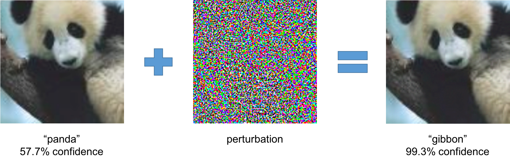

# Awesome Machine Learning Reliability 

> ###### 
 *Figure from "[Explaining and Harnessing Adversarial Examples](https://arxiv.org/abs/1412.6572)" by Goodfellow et al. ICLR15*

A curated list of awesome papers regarding machine learning reliability, inspired by [Awesome Machine Learning On Source Code](https://github.com/src-d/awesome-machine-learning-on-source-code) and [Awesome Adversarial Machine Learning](https://github.com/yenchenlin/awesome-adversarial-machine-learning).

## Contents
- [Conferences](#conferences)
- [Blogs](#blogs)
- [Competitions](#competitions)
- [Papers](#papers)
    - [Adversarial Computer Vision](#adversarial-computer-vision)
        - [Benchmarking](#benchmarking)
        - [Attack](#attack)
            - [White-box Attack](#white-box-attack)
            - [Black-box Attack](#black-box-attack)
            - [Real-world Attack](#real-world-attack)
        - [Defense](#defense)
            - [Adversarial Training](#adversarial-training)
            - [Manifold Projections](#manifold-projections)
            - [Adversarial Detection](#adversarial-detection)
            - [Model Compression](#model-compression)
    - [Adversarial NLP and Speech](#adversarial-nlp-and-speech)
    - [Provable and Verifiable AI Robustness](#provable-and-verifiable-ai-robustness)
    - [Machine Learning Testing](#machine-learning-testing)
    - [Empirical Study](#empirical-study)
    - [Survey](#survey)
    - [Other Applications](#other-applications)
    - [Other Resources](#other-resources)
- [License](#license)

## Conferences
### Security
* [ACM Conference on Computer and Communications Security (CCS)](https://www.sigsac.org/ccs/CCS2018/papers/)
* [IEEE Symposium on Security and Privacy (S&P)](https://www.ieee-security.org/TC/SP2018/)
* [Usenix Security Symposium (Usenix Security)](https://www.usenix.org/conference/usenixsecurity18)
* [The Network and Distributed System Security Symposium (NDSS)](https://www.ndss-symposium.org/)

### Machine Learning
* [International Conference on Learning Representations (ICLR)](https://www.iclr.cc/)
* [Annual Conference on Neural Information Processing Systems (NeurIPS)](https://neurips.cc/)
* [International Conference on Machine Learning (ICML)](https://icml.cc/)

### Natural Language Processing
* [Conference on Empirical Methods in Natural Language Processing (EMNLP)](http://emnlp2018.org/)
* [Annual Meeting of the Association for Computational Linguistics (ACL)](http://www.acl2019.org/EN/index.xhtml)

###### *[Conference Deadlines](https://zbchern.github.io/conferences/)*

## Blogs
* [Cleverhans](http://www.cleverhans.io/)
* [Adversarial Robustness - Theory and Practice](https://adversarial-ml-tutorial.org/)
* [Gradient Science](https://gradientscience.org/)
* [Attacking Machine Learning with Adversarial Examples (OpenAI)](https://blog.openai.com/adversarial-example-research/)

## Competitions
* [NeurIPS Adversarial Vision Challenge](https://www.crowdai.org/challenges/nips-2018-adversarial-vision-challenge)

## Papers
### Adversarial Computer Vision
 
### Attack
#### White-box Attack
* [ICLR15] [Explaining and Harnessing Adversarial Examples](https://arxiv.org/abs/1412.6572) - Ian J. Goodfellow, Jonathon Shlens, and Christian Szegedy.
* [S&P17] [Towards Evaluating the Robustness of Neural Networks](https://nicholas.carlini.com/papers/2017_sp_nnrobustattacks.pdf) - Nicholas Carlini and David Wagner. [[talk]](https://www.youtube.com/watch?v=yIXNL88JBWQ)
* [ICML18] [Obfuscated Gradients Give a False Sense of Security: Circumventing Defenses to Adversarial Examples](https://nicholas.carlini.com/papers/2018_icml_obfuscatedgradients.pdf) - Anish Athalye, Nicholas Carlini, and David Wagner. [[code]](https://github.com/anishathalye/obfuscated-gradients) [[talk]](https://nicholas.carlini.com/talks/2018_icml_obfuscatedgradients.mp4)
* [CVPR18] [Fooling Vision and Language Models Despite Localization and Attention Mechanism](http://openaccess.thecvf.com/content_cvpr_2018/CameraReady/3295.pdf) - Xiaojun Xu, Xinyun Chen, Chang Liu, Anna Rohrbach, Trevor Darrell, and Dawn Song.
* [IJCAI17] [Tactics of Adversarial Attack on Deep Reinforcement Learning Agents](https://arxiv.org/abs/1703.06748) - Yen-Chen Lin, Zhang-Wei Hong, Yuan-Hong Liao, Meng-Li Shih, Ming-Yu Liu, and Min Sun.
* [S&P16] [The Limitations of Deep Learning in Adversarial Settings](https://arxiv.org/abs/1511.07528) - Nicolas Papernot, Patrick McDaniel, Somesh Jha, Matt Fredrikson, Z. Berkay Celik, and Ananthram Swami.

#### Black-box Attack
* [Arxiv16] [Transferability in Machine Learning: from Phenomena to Black-Box Attacks using Adversarial Samples](https://arxiv.org/abs/1605.07277) - Nicolas Papernot, Patrick McDaniel, and Ian Goodfellow.
* [AISec17] [ZOO: Zeroth Order Optimization based Black-box Attacks to Deep Neural Networks without Training Substitute Models](https://arxiv.org/abs/1708.03999) - Pin-Yu Chen, Huan Zhang, Yash Sharma, Jinfeng Yi, and Cho-Jui Hsieh.
* [Arxiv17] [Query-Efficient Black-box Adversarial Examples](https://arxiv.org/abs/1712.07113) - Andrew Ilyas, Logan Engstrom, Anish Athalye, and Jessy Lin.

#### Real-world Attack
* [CVPR18] [Robust Physical-World Attacks on Deep Learning Models](https://arxiv.org/abs/1707.08945) - Kevin Eykholt, Ivan Evtimov, Earlence Fernandes, Bo Li, Amir Rahmati, Chaowei Xiao, Atul Prakash, Tadayoshi Kohno, and Dawn Song.
* [ICML18] [Synthesizing Robust Adversarial Examples](https://arxiv.org/abs/1707.07397) - Anish Athalye, Logan Engstrom, Andrew Ilyas, and Kevin Kwok.
* [CVPR17 Workshop] [NO Need to Worry about Adversarial Examples in Object Detection in Autonomous Vehicles](https://arxiv.org/abs/1707.03501) - Jiajun Lu, Hussein Sibai, Evan Fabry, and David Forsyth. [[slides]](http://www.jiajunlu.com/docs/AdversarialCar.pptx)
* [ICLR17] [Adversarial Examples in the Physical World](https://arxiv.org/abs/1607.02533) - Alexey Kurakin, Ian Goodfellow, and Samy Bengio.

#### Benchmarking
* [ICLR19] [Benchmarking Neural Network Robustness to Common Corruptions and Perturbations](https://openreview.net/forum?id=HJz6tiCqYm) - Dan Hendrycks and Thomas Dietterich.

### Defense

#### Adversarial Training

* [ICLR18] [Towards Deep Learning Models Resistant to Adversarial Attacks](https://arxiv.org/abs/1706.06083) - Aleksander Madry, Aleksandar Makelov, Ludwig Schmidt, Dimitris Tsipras, and Adrian Vladu. [[code (mnist)]](https://github.com/MadryLab/mnist_challenge) [[code (cifar10)]](https://github.com/MadryLab/cifar10_challenge)
* [NeurIPS17] [Defense against Adversarial Attacks Using High-Level Representation Guided Denoiser](https://arxiv.org/abs/1712.02976) - Fangzhou Liao, Ming Liang, Yinpeng Dong, Tianyu Pang, Xiaolin Hu, and Jun Zhu. [[code]](https://github.com/lfz/Guided-Denoise)
* [Arxiv18] [Adversarial Logit Pairing](https://arxiv.org/abs/1803.06373) - Harini Kannan, Alexey Kurakin, and Ian Goodfellow. [[code]](https://github.com/tensorflow/models/tree/master/research/adversarial_logit_pairing)
* [ICLR18] [Generating Natural Adversarial Examples](https://arxiv.org/abs/1710.11342) - Zhengli Zhao, Dheeru Dua, and Sameer Singh.

#### Adversarial Detection

* [AISec17] [Adversarial Examples Are Not Easily Detected: Bypassing Ten Detection Methods](https://arxiv.org/abs/1705.07263) - Nicholas Carlini and David Wagner.
* [NDSS18] [Feature Squeezing: Detecting Adversarial Examples in Deep Neural Networks](https://arxiv.org/abs/1704.01155) - Weilin Xu, David Evans, and Yanjun Qi.
* [NeurIPS18] [Attacks Meet Interpretability: Attribute-steered Detection of Adversarial Samples](https://arxiv.org/abs/1810.11580) - Guanhong Tao, Shiqing Ma, Yingqi Liu, and Xiangyu Zhang.

#### Model Compression

* [S&P16] [Distillation as a Defense to Adversarial Perturbations against Deep Neural Networks](https://arxiv.org/abs/1511.04508) - Nicolas Papernot, Patrick McDaniel, Xi Wu, Somesh Jha, and Ananthram Swami.
* [ICLR18] [Attacking Binarized Neural Networks](https://arxiv.org/abs/1711.00449) - Angus Galloway, Graham W. Taylor, and Medhat Moussa.
* [ICLR19] [Defensive Quantization: When Efficiency Meets Robustness](https://openreview.net/forum?id=ryetZ20ctX) - Ji Lin, Chuang Gan, and Song Han.

#### Manifold Projections
* [CCS17] [MagNet: A Two-Pronged Defense against Adversarial Examples](https://dl.acm.org/citation.cfm?id=3134057) - Dongyu Meng and Hao Chen.

## Adversarial NLP and Speech
* [Arxiv18] [Identifying and Controlling Important Neurons in Neural Machine Translation](https://arxiv.org/abs/1811.01157) - Anthony Bau, Yonatan Belinkov, Hassan Sajjad, Nadir Durrani, Fahim Dalvi, and James Glass.
* [Arxiv18] [Robust Neural Machine Translation with Joint Textual and Phonetic Embedding](https://arxiv.org/abs/1810.06729) - Hairong Liu, Mingbo Ma, Liang Huang, Hao Xiong, and Zhongjun He.
* [Arxiv18] [Improving the Robustness of Speech Translation](https://arxiv.org/abs/1811.00728) - Xiang Li, Haiyang Xue, Wei Chen, Yang Liu, Yang Feng, and Qun Liu.
* [Arxiv18] [Seq2Sick: Evaluating the Robustness of Sequence-to-Sequence Models with Adversarial Examples](https://arxiv.org/pdf/1803.01128.pdf) - Minhao Cheng, Jinfeng Yi, Huan Zhang, Pin-Yu Chen, and Cho-Jui Hsieh.
* [Arxiv18] [Greedy Attack and Gumbel Attack: Generating Adversarial Examples for Discrete Data](https://arxiv.org/pdf/1805.12316.pdf) - Puyudi Yang, Jianbo Chen, Cho-Jui Hsieh, Jane-Ling Wang, and Michael I. Jordan.
* [ICLR18] [Synthetic and Natural Noise Both Break Neural Machine Translation](https://arxiv.org/abs/1711.02173) - Yonatan Belinkov and Yonatan Bisk.
* [ACL18] [Towards Robust Neural Machine Translation](http://aclweb.org/anthology/P18-1163) - Yong Cheng, Zhaopeng Tu, Fandong Meng, Junjie Zhai, and Yang Liu.
* [ACL18] [Did the Model Understand the Question?](https://arxiv.org/abs/1805.054923) - Pramod Kaushik Mudrakarta, Ankur Taly, Mukund Sundararajan, and Kedar Dhamdhere.
* [ACL18] [Trick Me If You Can: Adversarial Writing of Trivia Challenge Questions [Student Research Workshop]](http://aclweb.org/anthology/P18-3018) - Eric Wallace and Jordan Boyd-Graber.
* [EMNLP18] [Generating natural language adversarial examples](https://arxiv.org/abs/1804.07998) - Moustafa Alzantot, Yash Sharma, Ahmed Elgohary, Bo-Jhang Ho, Mani Srivastava, and Kai-Wei Chang.
* [NAACL18] [Adversarial Example Generation with Syntactically Controlled Paraphrase Networks](http://aclweb.org/anthology/N18-1170) - Mohit Iyyer, John Wieting, Kevin Gimpel, and Luke Zettlemoyer.
* [COLING18] [On Adversarial Examples for Character-Level Neural Machine Translation](http://aclweb.org/anthology/C18-1055) - Javid Ebrahimi, Daniel Lowd, and Dejing Dou.
* [ICLR17] [Adversarial Training Methods for Semi-Supervised Text Classification](https://arxiv.org/abs/1605.07725) - Takeru Miyato, Andrew M. Dai, and Ian Goodfellow.
* [EMNLP17] [Adversarial Examples for Evaluating Reading Comprehension Systems](https://arxiv.org/abs/1707.07328) - Robin Jia and Percy Liang.
* [MILCOM16] [Crafting Adversarial Input Sequences for Recurrent Neural Networks](https://arxiv.org/abs/1604.08275) - Nicolas Papernot, Patrick McDaniel, Ananthram Swami, and Richard Harang.
* [CSAW16] [Hidden Voice Commands](https://nicholas.carlini.com/papers/2016_usenix_hiddenvoicecommands.pdf) - Nicholas Carlini, Pratyush Mishra, Tavish Vaidya, Yuankai Zhang, Micah Sherr, Clay Shields, David Wagner, and Wenchao Zhou. [[talk]](https://www.usenix.org/conference/usenixsecurity16/technical-sessions/presentation/carlini)

## Provable and Verifiable AI Robustness
* [ICML18] [Differentiable Abstract Interpretation for Provably Robust Neural Networks](http://proceedings.mlr.press/v80/mirman18b/mirman18b.pdf) - Matthew Mirman, Timon Gehr, and Martin Vechev.
* [ICML18] [Provable defenses against adversarial examples via the convex outer adversarial polytope](https://arxiv.org/abs/1711.00851) - Eric Wong and J. Zico Kolter. [[code]](https://github.com/locuslab/convex_adversarial)
* [ICLR18] [Certified Defenses against Adversarial Examples](https://arxiv.org/abs/1801.09344) - Aditi Raghunathan, Jacob Steinhardt, and Percy Liang.
* [Arxiv18] [On the Effectiveness of Interval Bound Propagation for Training Verifiably Robust Models](https://arxiv.org/abs/1810.12715) - Sven Gowal, Krishnamurthy Dvijotham, Robert Stanforth, Rudy Bunel, Chongli Qin, Jonathan Uesato, Relja Arandjelovic, Timothy Mann, and Pushmeet Kohli.
* [Arxiv18] [Training for Faster Adversarial Robustness Verification via Inducing ReLU Stability](https://arxiv.org/abs/1809.03008) - Kai Y. Xiao, Vincent Tjeng, Nur Muhammad Shafiullah, and Aleksander Madry.

## Machine Learning Testing
* [FSE18] [MODE: Automated Neural Network Model Debugging via State Differential Analysis and Input Selection](https://www.cs.purdue.edu/homes/ma229/papers/FSE18.pdf) - Shiqing Ma, Yingqi Liu, Wen-Chuan Lee, Xiangyu Zhang, Ananth Grama.
* [Arxiv18] [Testing Untestable Neural Machine Translation: An Industrial Case](https://arxiv.org/abs/1807.02340) - Wujie Zheng, Wenyu Wang, Dian Liu, Changrong Zhang, Qinsong Zeng, Yuetang Deng, Wei Yang, Pinjia He, Tao Xie.
* [ASE18] [DeepGauge: Multi-Granularity Testing Criteria for Deep Learning Systems](https://arxiv.org/abs/1803.07519) - Lei Ma, Felix Juefei-Xu, Fuyuan Zhang, Jiyuan Sun, Minhui Xue, Bo Li, Chunyang Chen, Ting Su, Li Li, Yang Liu, Jianjun Zhao, Yadong Wang.
* [ICSE18] [DeepTest: Automated Testing of Deep-Neural-Network-driven Autonomous Cars](https://arxiv.org/abs/1708.08559) - Yuchi Tian, Kexin Pei, Suman Jana, Baishakhi Ray.
* [SOSP17] [DeepXplore: Automated Whitebox Testing of Deep Learning Systems](https://arxiv.org/abs/1705.06640) - Kexin Pei, Yinzhi Cao, Junfeng Yang, Suman Jana.
* [KDD16] ["Why Should I Trust You?": Explaining the Predictions of Any Classifier](https://arxiv.org/abs/1602.04938) - Marco Tulio Ribeiro, Sameer Singh, and Carlos Guestrin. [[code]](https://github.com/marcotcr/lime), [[slides]](https://drive.google.com/file/d/0ByblrZgHugfYZ0ZCSWNPWFNONEU/view), [[video]](https://www.youtube.com/watch?v=hUnRCxnydCc)

## Empirical Study
* [ECCV18] [Is Robustness the Cost of Accuracy? -- A Comprehensive Study on the Robustness of 18 Deep Image Classification Models](https://arxiv.org/abs/1808.01688) - Dong Su, Huan Zhang, Hongge Chen, Jinfeng Yi, Pin-Yu Chen, Yupeng Gao. [[code]](https://github.com/huanzhang12/Adversarial_Survey)

## Survey
* [Arxiv17] [Adversarial Examples: Attacks and Defenses for Deep Learning](https://arxiv.org/abs/1712.07107) - Xiaoyong Yuan, Pan He, Qile Zhu, and Xiaolin Li.
* [Arxiv18] [Adversarial Examples - A Complete Characterisation of the Phenomenon](https://arxiv.org/abs/1810.01185) - Alexandru Constantin Serban and Erik Poll.
* [Arxiv18] [Threat of Adversarial Attacks on Deep Learning in Computer Vision: A Survey](https://arxiv.org/abs/1801.00553) - Naveed Akhtar, and Ajmal Mian.

## Other Applications
* [Arxiv17] [Black-Box Attacks against RNN based Malware Detection Algorithms](https://arxiv.org/abs/1705.08131) - Weiwei Hu, Ying Tan

## Other Resources
* [Trustworthy Machine Learning](http://trustworthymachinelearning.org/) - A suite of tools for making machine learning secure and trustworthy

## License

  
   
  To the extent possible under law,
  <a rel="dct:publisher"
     href="https://github.com/zbchern/awesome_machine_learning_reliability">
    Zhuangbin Chen</a>
  has waived all copyright and related or neighboring rights to
  Awesome Machine Learning Reliability.
This work is published from:

  China.

